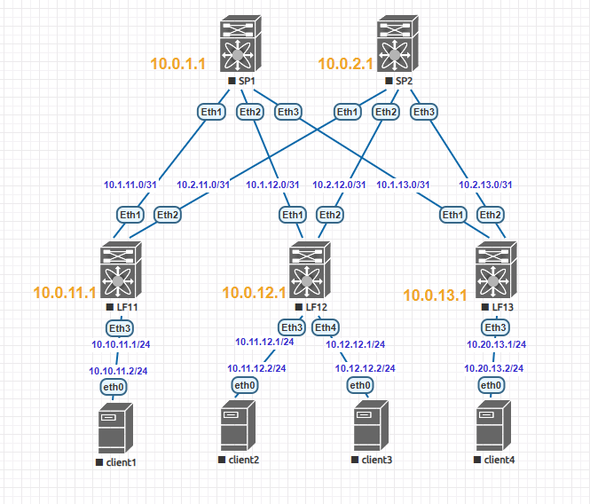

### Тема: Основы проектирования сети

#### Цель: собрать схему CLOS и распределить адресное пространство.

#### План работ:

    1. Собрать топологию CLOS;
    2. Распределить адресное пространство для underlay-сети;
    3. Зафиксировать в документации адресное пространство, схему сети, настройки оборудования.

#### Топология сети

#### Распределение адресного пространства
##### 1. Номера устройств:
- Spine - 1,2,...,9
- Leaf  - 11,12,...,49

##### 2. Loopback-интерфейсы
Формат loopback-интерфейсов: *10.0.<device_number>.<interface_number>*

|**Device**| **Port** | **IP-address** |
| ---------|:---------| :--------------|
| SP1      | Lo1      | 10.0.1.1/32    |
| SP2      | Lo1      | 10.0.2.1/32    |
| LF11     | Lo1      | 10.0.11.1/32   |
| LF12     | Lo1      | 10.0.12.1/32   |
| LF13     | Lo1      | 10.0.13.1/32   |

##### 3. Link-интерфейсы
Формат link-интерфейсов: *10.<spine_number>.<leaf_number>*.<0|1>/31

|**Device**|**Port**|**IP-address1**|< -- >|**IP-address2**|**Port**|**Device** |
| ---------|:-------|:--------------|------|:--------------|:-------|:----------|
| SP1      |Eth1    |10.1.11.0/31   |< -- >|10.1.11.1/31   |Eth1    | LF11      |
| SP1      |Eth2    |10.1.12.0/31   |< -- >|10.1.12.1/31   |Eth1    | LF12      |
| SP1      |Eth3    |10.1.13.0/31   |< -- >|10.1.13.1/31   |Eth1    | LF13      |
| SP2      |Eth1    |10.2.11.0/31   |< -- >|10.2.11.1/31   |Eth1    | LF11      |
| SP2      |Eth2    |10.2.12.0/31   |< -- >|10.2.12.1/31   |Eth1    | LF12      |
| SP2      |Eth3    |10.2.13.0/31   |< -- >|10.2.13.1/31   |Eth1    | LF13      |

##### 3. Link-интерфейсы клиентского блока
Формат link-интерфейсов leaf: *10.<VLAN_number>.<leaf_number>*.1>/24

Формат link-интерфейсов клиентов: *10.<VLAN_number>.<leaf_number>*.<10-254>/24

|**Device**|**Port**|**IP-address1**|< -- >|**IP-address2**|**Port**|**Device** |
| ---------|:-------|:--------------|------|:--------------|:-------|:----------|
| LF11     |Eth3    |10.10.11.1/24  |< -- >|10.10.11.10/24 |Eth0    | Client1   |
| LF12     |Eth3    |10.11.12.1/24  |< -- >|10.11.12.10/24 |Eth0    | Client2   |
| LF12     |Eth4    |10.12.12.1/24  |< -- >|10.12.12.10/24 |Eth0    | Client3   |
| LF13     |Eth3    |10.20.13.1/24  |< -- >|10.20.13.10/24 |Eth0    | Client4   |
