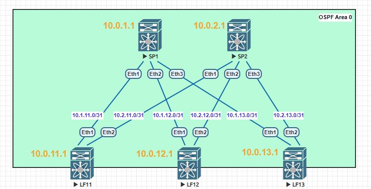

### Тема: Построение underlay-сети (OSPF)

#### Цель: построить underlay-сеть с использованием OSPF.

#### План работ:

    1. В существующей топологии Clos настроить OSPF для underlay-сети;
    2. Подтвердить правильность настройки тестами;
    3. Зафиксировать в документации схему сети, настройки оборудования, результаты тестов.

#### Топология сети


#### Настройка BFD 
1. Для leaf- и spine-узлов на интерфейсах пиринга настраиваем BFD с параметрами `100/100/3`.

#### Настройка OSPF 
1. Для leaf- и spine-узлов интерфейсы пиринга и loopback располагаем в OSPF area 0.0.0.0 ;
2. Для leaf- и spine-узлов интерфейсы пиринга делаем point-to-point для предотвращения выбора DR/BRD ;
3. На leaf- и spine-узлах вручную задаем router-id=<loopback1_IP> ;
4. На leaf- и spine-узлах в процессе OSPF используем `passive-interface default` за исключением пиринговых интерфейсов ;
5. Для leaf- и spine-узлов на интерфейсах пиринга настраиваем аутентификацию OSPF с MD5.

#### Результаты тестирования BFD
---
**LF11**
```python
DstAddr        MyDisc    YourDisc  Interface/Transport    Type          LastUp 
---------- ----------- ----------- -------------------- ------- ---------------
10.1.11.0   288880520  1304555567        Ethernet1(14)  normal  05/13/26 14:39 
10.2.11.0  1276670253  3079798434        Ethernet2(15)  normal  05/13/26 14:39 
```
**LF12**
```python
DstAddr        MyDisc    YourDisc  Interface/Transport    Type          LastUp 
---------- ----------- ----------- -------------------- ------- ---------------
10.1.12.0  1812259600  3248262931        Ethernet1(14)  normal  05/13/26 14:39 
10.2.12.0  2355158955  1110963957        Ethernet2(15)  normal  05/13/26 14:39 
```
**LF13**
```python
DstAddr        MyDisc    YourDisc  Interface/Transport    Type          LastUp 
---------- ----------- ----------- -------------------- ------- ---------------
10.1.13.0  4276919913   306908499        Ethernet1(14)  normal  05/13/26 14:39 
10.2.13.0   557060380  1738572429        Ethernet2(15)  normal  05/13/26 14:39 
```
**SP1**
```python
DstAddr        MyDisc    YourDisc  Interface/Transport    Type          LastUp 
---------- ----------- ----------- -------------------- ------- ---------------
10.1.11.1  1304555567   288880520        Ethernet1(14)  normal  05/13/26 14:39 
10.1.12.1  3248262931  1812259600        Ethernet2(15)  normal  05/13/26 14:39 
10.1.13.1   306908499  4276919913        Ethernet3(16)  normal  05/13/26 14:39 
```
**SP2**
```python
DstAddr        MyDisc    YourDisc  Interface/Transport    Type          LastUp 
---------- ----------- ----------- -------------------- ------- ---------------
10.2.11.1  3079798434  1276670253        Ethernet1(14)  normal  05/13/26 14:39 
10.2.12.1  1110963957  2355158955        Ethernet2(15)  normal  05/13/26 14:39 
10.2.13.1  1738572429   557060380        Ethernet3(16)  normal  05/13/26 14:39 
```

#### Результаты тестирования OSPF
---
1. ##### Установленные соседства
**LF11**
```python
Neighbor ID     Instance VRF      Pri State                  Dead Time   Address         Interface
10.0.1.1        1        default  0   FULL                   00:00:38    10.1.11.0       Ethernet1
10.0.2.1        1        default  0   FULL                   00:00:37    10.2.11.0       Ethernet2
```
**LF12**
```python
Neighbor ID     Instance VRF      Pri State                  Dead Time   Address         Interface
10.0.1.1        1        default  0   FULL                   00:00:33    10.1.12.0       Ethernet1
10.0.2.1        1        default  0   FULL                   00:00:35    10.2.12.0       Ethernet2
```
**LF13**
```python
Neighbor ID     Instance VRF      Pri State                  Dead Time   Address         Interface
10.0.1.1        1        default  0   FULL                   00:00:38    10.1.13.0       Ethernet1
10.0.2.1        1        default  0   FULL                   00:00:38    10.2.13.0       Ethernet2
```
**SP1**
```python
Neighbor ID     Instance VRF      Pri State                  Dead Time   Address         Interface
10.0.12.1       1        default  0   FULL                   00:00:35    10.1.12.1       Ethernet2
10.0.11.1       1        default  0   FULL                   00:00:35    10.1.11.1       Ethernet1
10.0.13.1       1        default  0   FULL                   00:00:34    10.1.13.1       Ethernet3
```
**SP2**
```python
Neighbor ID     Instance VRF      Pri State                  Dead Time   Address         Interface
10.0.11.1       1        default  0   FULL                   00:00:37    10.2.11.1       Ethernet1
10.0.12.1       1        default  0   FULL                   00:00:36    10.2.12.1       Ethernet2
10.0.13.1       1        default  0   FULL                   00:00:32    10.2.13.1       Ethernet3
```
---
2. ##### Таблицы маршрутизации
**LF11**
```python

 O        10.0.1.1/32 [110/20] via 10.1.11.0, Ethernet1
 O        10.0.2.1/32 [110/20] via 10.2.11.0, Ethernet2
 O        10.0.12.1/32 [110/30] via 10.1.11.0, Ethernet1
                                via 10.2.11.0, Ethernet2
 O        10.0.13.1/32 [110/30] via 10.1.11.0, Ethernet1
                                via 10.2.11.0, Ethernet2
 O        10.1.12.0/31 [110/20] via 10.1.11.0, Ethernet1
 O        10.1.13.0/31 [110/20] via 10.1.11.0, Ethernet1
 O        10.2.12.0/31 [110/20] via 10.2.11.0, Ethernet2
 O        10.2.13.0/31 [110/20] via 10.2.11.0, Ethernet2
```
**LF12**
```python
 O        10.0.1.1/32 [110/20] via 10.1.12.0, Ethernet1
 O        10.0.2.1/32 [110/20] via 10.2.12.0, Ethernet2
 O        10.0.11.1/32 [110/30] via 10.1.12.0, Ethernet1
                                via 10.2.12.0, Ethernet2
 O        10.0.13.1/32 [110/30] via 10.1.12.0, Ethernet1
                                via 10.2.12.0, Ethernet2
 O        10.1.11.0/31 [110/20] via 10.1.12.0, Ethernet1
 O        10.1.13.0/31 [110/20] via 10.1.12.0, Ethernet1
 O        10.2.11.0/31 [110/20] via 10.2.12.0, Ethernet2
 O        10.2.13.0/31 [110/20] via 10.2.12.0, Ethernet2
```
**LF13**
```python
 O        10.0.1.1/32 [110/20] via 10.1.13.0, Ethernet1
 O        10.0.2.1/32 [110/20] via 10.2.13.0, Ethernet2
 O        10.0.11.1/32 [110/30] via 10.1.13.0, Ethernet1
                                via 10.2.13.0, Ethernet2
 O        10.0.12.1/32 [110/30] via 10.1.13.0, Ethernet1
                                via 10.2.13.0, Ethernet2
 O        10.1.11.0/31 [110/20] via 10.1.13.0, Ethernet1
 O        10.1.12.0/31 [110/20] via 10.1.13.0, Ethernet1
 O        10.2.11.0/31 [110/20] via 10.2.13.0, Ethernet2
 O        10.2.12.0/31 [110/20] via 10.2.13.0, Ethernet2
```
**SP1**
```python
O        10.0.2.1/32 [110/30] via 10.1.11.1, Ethernet1
                               via 10.1.12.1, Ethernet2
                               via 10.1.13.1, Ethernet3
 O        10.0.11.1/32 [110/20] via 10.1.11.1, Ethernet1
 O        10.0.12.1/32 [110/20] via 10.1.12.1, Ethernet2
 O        10.0.13.1/32 [110/20] via 10.1.13.1, Ethernet3
 O        10.2.11.0/31 [110/20] via 10.1.11.1, Ethernet1
 O        10.2.12.0/31 [110/20] via 10.1.12.1, Ethernet2
 O        10.2.13.0/31 [110/20] via 10.1.13.1, Ethernet3
```
**SP2**
```python

 O        10.0.1.1/32 [110/30] via 10.2.11.1, Ethernet1
                               via 10.2.12.1, Ethernet2
                               via 10.2.13.1, Ethernet3
 O        10.0.11.1/32 [110/20] via 10.2.11.1, Ethernet1
 O        10.0.12.1/32 [110/20] via 10.2.12.1, Ethernet2
 O        10.0.13.1/32 [110/20] via 10.2.13.1, Ethernet3
 O        10.1.11.0/31 [110/20] via 10.2.11.1, Ethernet1
 O        10.1.12.0/31 [110/20] via 10.2.12.1, Ethernet2
 O        10.1.13.0/31 [110/20] via 10.2.13.1, Ethernet3
```
---
3. ##### Доступность Loopback
**LF11-LF12**
```python
LF11#ping 10.0.12.1 source lo1 
PING 10.0.12.1 (10.0.12.1) from 10.0.11.1 : 72(100) bytes of data.
--- 10.0.12.1 ping statistics ---
5 packets transmitted, 5 received, 0% packet loss, time 77ms
```

**LF11-LF13**
```python
LF11#ping 10.0.13.1 source lo1
PING 10.0.13.1 (10.0.13.1) from 10.0.11.1 : 72(100) bytes of data.
--- 10.0.13.1 ping statistics ---
5 packets transmitted, 5 received, 0% packet loss, time 75ms
```
**LF12-LF13**
```python
LF12#ping 10.0.13.1 source lo1
PING 10.0.13.1 (10.0.13.1) from 10.0.12.1 : 72(100) bytes of data.
--- 10.0.13.1 ping statistics ---
5 packets transmitted, 5 received, 0% packet loss, time 78ms
```
**LF11-SP1**
```python
LF11#ping 10.0.1.1 source lo1
PING 10.0.1.1 (10.0.1.1) from 10.0.11.1 : 72(100) bytes of data.
--- 10.0.1.1 ping statistics ---
5 packets transmitted, 5 received, 0% packet loss, time 50ms
```
Доступность в прочих парах устройств также подтверждена аналогичным способом.

---

### Вывод: связанность устройств в underlay-сети с помощью протокола OSPF подтверждена.