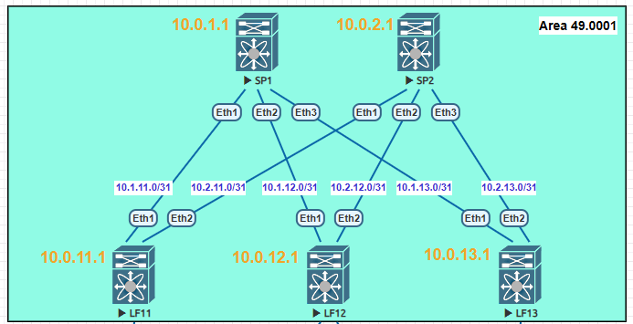

### Тема: Построение underlay-сети (IS-IS)

#### Цель: построить underlay-сеть с использованием IS-IS.

#### План работ:

    1. В существующей топологии Clos настроить IS-IS для underlay-сети;
    2. Подтвердить правильность настройки тестами;
    3. Зафиксировать в документации схему сети, настройки оборудования, результаты тестов.

#### Топология сети


#### Настройка IS-IS 
1. На leaf- и spine-узлах вручную задаем `router-id=<loopback1_IP>`;
2. Leaf- и spine-узлы располагаем в процессе `router isis UNDERLAY`;
3. Все leaf- и spine-узлы находятся в `area 49.0001` и параметр NET формируем по шаблону `49.0001.0000.0000.00<device_number>.00`;
4. На всех leaf- и spine-узлах делаем IS-IS процесс `UNDERLAY is-type level-2` для простоты и гибкости;
5. Для leaf- и spine-узлов интерфейсы пиринга и loopback включаем в процесс `UNDERLAY`  и делаем `isis circuit-type level-2` для оптимизации (предотвращение HELLO type-1);
6. Для leaf- и spine-узлов интерфейсы пиринга делаем `point-to-point` для оптимизации (предотвращения выборов и т.д.)  ;
7. На loopback-интерфейсах leaf- и spine-узлов блокируем отправку HELLO `isis passive`;

#### Результаты тестирования IS-IS
---
1. ##### Установленные соседства
**LF11**
```python
Instance  VRF      System Id  Type Interface  SNPA  State Hold time   Circuit Id
UNDERLAY  default  SP1        L2   Ethernet1  P2P   UP    22          0E        
UNDERLAY  default  SP2        L2   Ethernet2  P2P   UP    29          0E        
```
**LF12**
```python
Instance  VRF      System Id  Type Interface  SNPA  State Hold time   Circuit Id
UNDERLAY  default  SP1        L2   Ethernet1  P2P   UP    28          0F        
UNDERLAY  default  SP2        L2   Ethernet2  P2P   UP    29          0F        
```
**LF13**
```python
Instance  VRF      System Id  Type Interface  SNPA  State Hold time   Circuit Id
UNDERLAY  default  SP1        L2   Ethernet1  P2P   UP    25          10        
UNDERLAY  default  SP2        L2   Ethernet2  P2P   UP    25          10        
```
**SP1**
```python
Instance  VRF      System Id  Type Interface  SNPA  State Hold time   Circuit Id
UNDERLAY  default  LF11       L2   Ethernet1  P2P   UP    25          0E        
UNDERLAY  default  LF12       L2   Ethernet2  P2P   UP    26          0E        
UNDERLAY  default  LF13       L2   Ethernet3  P2P   UP    23          0E        
```
**SP2**
```python
Instance  VRF      System Id  Type Interface  SNPA  State Hold time   Circuit Id
UNDERLAY  default  LF11       L2   Ethernet1  P2P   UP    28          0F        
UNDERLAY  default  LF12       L2   Ethernet2  P2P   UP    22          0F        
UNDERLAY  default  LF13       L2   Ethernet3  P2P   UP    22          0F        
```
---
2. ##### Таблицы маршрутизации
**LF11**
```python
 I L2     10.0.1.1/32 [115/20] via 10.1.11.0, Ethernet1
 I L2     10.0.2.1/32 [115/20] via 10.2.11.0, Ethernet2
 I L2     10.0.12.1/32 [115/30] via 10.1.11.0, Ethernet1
                                via 10.2.11.0, Ethernet2
 I L2     10.0.13.1/32 [115/30] via 10.1.11.0, Ethernet1
                                via 10.2.11.0, Ethernet2
 I L2     10.1.12.0/31 [115/20] via 10.1.11.0, Ethernet1
 I L2     10.1.13.0/31 [115/20] via 10.1.11.0, Ethernet1
 I L2     10.2.12.0/31 [115/20] via 10.2.11.0, Ethernet2
 I L2     10.2.13.0/31 [115/20] via 10.2.11.0, Ethernet2
```
**LF12**
```python
 I L2     10.0.1.1/32 [115/20] via 10.1.12.0, Ethernet1
 I L2     10.0.2.1/32 [115/20] via 10.2.12.0, Ethernet2
 I L2     10.0.11.1/32 [115/30] via 10.1.12.0, Ethernet1
                                via 10.2.12.0, Ethernet2
 I L2     10.0.13.1/32 [115/30] via 10.1.12.0, Ethernet1
                                via 10.2.12.0, Ethernet2
 I L2     10.1.11.0/31 [115/20] via 10.1.12.0, Ethernet1
 I L2     10.1.13.0/31 [115/20] via 10.1.12.0, Ethernet1
 I L2     10.2.11.0/31 [115/20] via 10.2.12.0, Ethernet2
 I L2     10.2.13.0/31 [115/20] via 10.2.12.0, Ethernet2
```
**LF13**
```python
 I L2     10.0.1.1/32 [115/20] via 10.1.13.0, Ethernet1
 I L2     10.0.2.1/32 [115/20] via 10.2.13.0, Ethernet2
 I L2     10.0.11.1/32 [115/30] via 10.1.13.0, Ethernet1
                                via 10.2.13.0, Ethernet2
 I L2     10.0.12.1/32 [115/30] via 10.1.13.0, Ethernet1
                                via 10.2.13.0, Ethernet2
 I L2     10.1.11.0/31 [115/20] via 10.1.13.0, Ethernet1
 I L2     10.1.12.0/31 [115/20] via 10.1.13.0, Ethernet1
 I L2     10.2.11.0/31 [115/20] via 10.2.13.0, Ethernet2
 I L2     10.2.12.0/31 [115/20] via 10.2.13.0, Ethernet2
```
**SP1**
```python
 I L2     10.0.2.1/32 [115/30] via 10.1.11.1, Ethernet1
                               via 10.1.12.1, Ethernet2
                               via 10.1.13.1, Ethernet3
 I L2     10.0.11.1/32 [115/20] via 10.1.11.1, Ethernet1
 I L2     10.0.12.1/32 [115/20] via 10.1.12.1, Ethernet2
 I L2     10.0.13.1/32 [115/20] via 10.1.13.1, Ethernet3
 I L2     10.2.11.0/31 [115/20] via 10.1.11.1, Ethernet1
 I L2     10.2.12.0/31 [115/20] via 10.1.12.1, Ethernet2
 I L2     10.2.13.0/31 [115/20] via 10.1.13.1, Ethernet3
```
**SP2**
```python
 I L2     10.0.1.1/32 [115/30] via 10.2.11.1, Ethernet1
                               via 10.2.12.1, Ethernet2
                               via 10.2.13.1, Ethernet3
 I L2     10.0.11.1/32 [115/20] via 10.2.11.1, Ethernet1
 I L2     10.0.12.1/32 [115/20] via 10.2.12.1, Ethernet2
 I L2     10.0.13.1/32 [115/20] via 10.2.13.1, Ethernet3
 I L2     10.1.11.0/31 [115/20] via 10.2.11.1, Ethernet1
 I L2     10.1.12.0/31 [115/20] via 10.2.12.1, Ethernet2
 I L2     10.1.13.0/31 [115/20] via 10.2.13.1, Ethernet3
```
---
3. ##### Доступность Loopback
**LF11-LF12**
```python
LF11#ping 10.0.12.1 source lo1 
PING 10.0.12.1 (10.0.12.1) from 10.0.11.1 : 72(100) bytes of data.
--- 10.0.12.1 ping statistics ---
5 packets transmitted, 5 received, 0% packet loss, time 69ms
```

**LF11-LF13**
```python
LF11#ping 10.0.13.1 source lo1
PING 10.0.13.1 (10.0.13.1) from 10.0.11.1 : 72(100) bytes of data.
--- 10.0.13.1 ping statistics ---
5 packets transmitted, 5 received, 0% packet loss, time 78ms
```
**LF12-LF13**
```python
LF12#ping 10.0.13.1 source lo1
PING 10.0.13.1 (10.0.13.1) from 10.0.12.1 : 72(100) bytes of data.
--- 10.0.13.1 ping statistics ---
5 packets transmitted, 5 received, 0% packet loss, time 63ms
```
**LF11-SP1**
```python
LF11#ping 10.0.1.1 source lo1
PING 10.0.1.1 (10.0.1.1) from 10.0.11.1 : 72(100) bytes of data.
--- 10.0.1.1 ping statistics ---
5 packets transmitted, 5 received, 0% packet loss, time 49ms
```
Доступность в прочих парах устройств также подтверждена аналогичным способом.

---

### Вывод: связанность устройств в underlay-сети с помощью протокола IS-IS подтверждена.