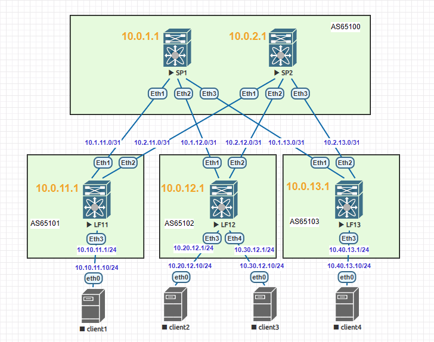

### Тема: Построение underlay-сети (eBGP)

#### Цель: построить underlay-сеть с использованием eBGP.

#### План работ:

    1. В существующей топологии Clos настроить eBGP для underlay-сети;
    2. Подтвердить правильность настройки тестами;
    3. Зафиксировать в документации схему сети, настройки оборудования, результаты тестов.

#### Топология сети


#### Настройка eBGP 
1. На leaf- и spine-узлах создаем процесс BGP с номером AS ;
2. На leaf- и spine-узлах вручную задаем `router-id=<loopback1_IP>`;
3. На leaf- и spine-узлах включаем ECMP (4 пути) `maximum-paths 4 ecmp 4>`;
4. На leaf-узлах:
    - создаем шаблон для spine-узлов:
        - шаблон для группы spine-узлов `neighbor SPINES peer group`
        - AS для группы spine-узлов `neighbor SPINES remote-as 65100`
        - включаем BFD для группы spine-узлов `neighbor SPINES bfd`
        - корректировка таймеров для группы spine-узлов `neighbor SPINES timers 1 3`
    - применяем шаблон к spine-соседям
        ```python
        neighbor 10.1.11.0 peer group SPINES
        neighbor 10.2.11.0 peer group SPINES
        ```
    - активируем группу spine-узлов и объявляем локальный loopback-интерфейс
        ```python
        address-family ipv4
            neighbor SPINES activate
            network <loopback1_IP>
        ```
6. На spine-узлах:
    - создаем peer-фильтр для автоматического приема BGP-сессий из диапазона AS65101-65107 (с запасом на расширение)
        ```python
        peer-filter PF_LEAF_AS
            10 match as-range 65101-65107 result accept`
        ```
    - указываем суммарный префикс источников BGP-сессий со стороны leaf-узлов
    ```python
    bgp listen range 10.0.0.0/13 peer-group LEAFS peer-filter PF_LEAF_AS
    ```
    - создаем шаблон для leaf-узлов:
        - шаблон для группы leaf-узлов `neighbor LEAFS peer group`
        - BFD для группы leaf-узлов`neighbor LEAFS bfd`
        - корректировка таймеров для группы leaf-узлов `neighbor LEAFS timers 1 3`
    - активируем группу leaf-узлов и объявляем локальный loopback-интерфейс
        ```python
        address-family ipv4
            neighbor LEAFS activate
            network <loopback1_IP>
        ```


#### Результаты тестирования eBGP
---
1. ##### Установленные соседства eBGP
**LF11**
```python
BGP summary information for VRF default
Router identifier 10.0.11.1, local AS number 65101
Neighbor Status Codes: m - Under maintenance
  Neighbor  V AS           MsgRcvd   MsgSent  InQ OutQ  Up/Down State   PfxRcd PfxAcc
  10.1.11.0 4 65100            650       649    0    0 00:09:08 Estab   3      3
  10.2.11.0 4 65100            641       644    0    0 00:09:02 Estab   3      3
```
**LF12**
```python
BGP summary information for VRF default
Router identifier 10.0.11.2, local AS number 65102
Neighbor Status Codes: m - Under maintenance
  Neighbor  V AS           MsgRcvd   MsgSent  InQ OutQ  Up/Down State   PfxRcd PfxAcc
  10.1.12.0 4 65100            688       694    0    0 00:09:47 Estab   3      3
  10.2.12.0 4 65100            688       688    0    0 00:09:41 Estab   3      3
```
**LF13**
```python
BGP summary information for VRF default
Router identifier 10.0.11.3, local AS number 65103
Neighbor Status Codes: m - Under maintenance
  Neighbor  V AS           MsgRcvd   MsgSent  InQ OutQ  Up/Down State   PfxRcd PfxAcc
  10.1.13.0 4 65100            693       694    0    0 00:09:48 Estab   3      3
  10.2.13.0 4 65100            682       689    0    0 00:09:41 Estab   3      3
```
**SP1**
```python
BGP summary information for VRF default
Router identifier 10.0.1.1, local AS number 65100
Neighbor Status Codes: m - Under maintenance
  Neighbor  V AS           MsgRcvd   MsgSent  InQ OutQ  Up/Down State   PfxRcd PfxAcc
  10.1.11.1 4 65101            694       697    0    0 00:09:47 Estab   1      1
  10.1.12.1 4 65102            694       689    0    0 00:09:47 Estab   1      1
  10.1.13.1 4 65103            694       693    0    0 00:09:48 Estab   1      1
```
**SP2**
```python
BGP summary information for VRF default
Router identifier 10.0.2.1, local AS number 65100
Neighbor Status Codes: m - Under maintenance
  Neighbor  V AS           MsgRcvd   MsgSent  InQ OutQ  Up/Down State   PfxRcd PfxAcc
  10.2.11.1 4 65101            688       687    0    0 00:09:41 Estab   1      1
  10.2.12.1 4 65102            687       688    0    0 00:09:41 Estab   1      1
  10.2.13.1 4 65103            689       683    0    0 00:09:41 Estab   1      1
```
---
2. ##### Таблицы маршрутизации
**LF11**
```python
 B E      10.0.1.1/32 [200/0] via 10.1.11.0, Ethernet1
 B E      10.0.2.1/32 [200/0] via 10.2.11.0, Ethernet2
 C        10.0.11.1/32 is directly connected, Loopback1
 B E      10.0.12.1/32 [200/0] via 10.1.11.0, Ethernet1
                               via 10.2.11.0, Ethernet2
 B E      10.0.13.1/32 [200/0] via 10.1.11.0, Ethernet1
                               via 10.2.11.0, Ethernet2
 C        10.1.11.0/31 is directly connected, Ethernet1
 C        10.2.11.0/31 is directly connected, Ethernet2
 C        10.10.11.0/24 is directly connected, Ethernet3
```
**LF12**
```python
 B E      10.0.1.1/32 [200/0] via 10.1.12.0, Ethernet1
 B E      10.0.2.1/32 [200/0] via 10.2.12.0, Ethernet2
 B E      10.0.11.1/32 [200/0] via 10.1.12.0, Ethernet1
                               via 10.2.12.0, Ethernet2
 C        10.0.12.1/32 is directly connected, Loopback1
 B E      10.0.13.1/32 [200/0] via 10.1.12.0, Ethernet1
                               via 10.2.12.0, Ethernet2
 C        10.1.12.0/31 is directly connected, Ethernet1
 C        10.2.12.0/31 is directly connected, Ethernet2
 C        10.20.12.0/24 is directly connected, Ethernet3
 C        10.30.12.0/24 is directly connected, Ethernet4
```
**LF13**
```python
 B E      10.0.1.1/32 [200/0] via 10.1.13.0, Ethernet1
 B E      10.0.2.1/32 [200/0] via 10.2.13.0, Ethernet2
 B E      10.0.11.1/32 [200/0] via 10.1.13.0, Ethernet1
                               via 10.2.13.0, Ethernet2
 B E      10.0.12.1/32 [200/0] via 10.1.13.0, Ethernet1
                               via 10.2.13.0, Ethernet2
 C        10.0.13.1/32 is directly connected, Loopback1
 C        10.1.13.0/31 is directly connected, Ethernet1
 C        10.2.13.0/31 is directly connected, Ethernet2
 C        10.40.13.0/24 is directly connected, Ethernet3
```
**SP1**
```python
 C        10.0.1.1/32 is directly connected, Loopback1
 B E      10.0.11.1/32 [200/0] via 10.1.11.1, Ethernet1
 B E      10.0.12.1/32 [200/0] via 10.1.12.1, Ethernet2
 B E      10.0.13.1/32 [200/0] via 10.1.13.1, Ethernet3
 C        10.1.11.0/31 is directly connected, Ethernet1
 C        10.1.12.0/31 is directly connected, Ethernet2
 C        10.1.13.0/31 is directly connected, Ethernet3

```
**SP2**
```python
 C        10.0.2.1/32 is directly connected, Loopback1
 B E      10.0.11.1/32 [200/0] via 10.2.11.1, Ethernet1
 B E      10.0.12.1/32 [200/0] via 10.2.12.1, Ethernet2
 B E      10.0.13.1/32 [200/0] via 10.2.13.1, Ethernet3
 C        10.2.11.0/31 is directly connected, Ethernet1
 C        10.2.12.0/31 is directly connected, Ethernet2
 C        10.2.13.0/31 is directly connected, Ethernet3
```
---
3. ##### Доступность Loopback
**LF11-LF12**
```python
LF11#ping 10.0.12.1 so lo1
PING 10.0.12.1 (10.0.12.1) from 10.0.11.1 : 72(100) bytes of data.
--- 10.0.12.1 ping statistics ---
5 packets transmitted, 5 received, 0% packet loss, time 65ms
```

**LF11-LF13**
```python
LF11#ping 10.0.13.1 so lo1
PING 10.0.13.1 (10.0.13.1) from 10.0.11.1 : 72(100) bytes of data.
--- 10.0.13.1 ping statistics ---
5 packets transmitted, 5 received, 0% packet loss, time 88ms
```
**LF12-LF13**
```python
LF12#ping 10.0.13.1 so lo1
PING 10.0.13.1 (10.0.13.1) from 10.0.12.1 : 72(100) bytes of data.
--- 10.0.13.1 ping statistics ---
5 packets transmitted, 5 received, 0% packet loss, time 67ms
```
**LF11-SP1**
```python
LF11#ping 10.0.1.1 so lo1
PING 10.0.1.1 (10.0.1.1) from 10.0.11.1 : 72(100) bytes of data.
--- 10.0.1.1 ping statistics ---
5 packets transmitted, 5 received, 0% packet loss, time 26ms
```
**LF11-SP2**
```python
LF11#ping 10.0.2.1 so lo1
PING 10.0.2.1 (10.0.2.1) from 10.0.11.1 : 72(100) bytes of data.
--- 10.0.2.1 ping statistics ---
5 packets transmitted, 5 received, 0% packet loss, time 45ms
```
Доступность в прочих парах устройств также подтверждена аналогичным способом.

---

### Вывод: связанность устройств в underlay-сети с помощью протокола eBGP подтверждена.