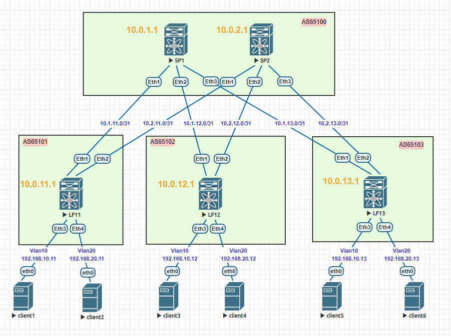

### Тема: Настройка VxLAN EVPN L2 VNI

#### Цель: настроить overlay на основе VxLAN EVPN для L2 связанности между клиентами.

#### План работ:

    1. В существующей топологии Clos настроить eBGP для underlay-сети;
    2. Настроить overlay на основе VxLAN EVPN MP-BGP для L2 связанности между клиентами;
    3. Подтвердить правильность настройки тестами;
    4. Зафиксировать в документации схему сети, настройки оборудования, результаты тестов.

#### Топология сети


#### Адресация клиентов

|**Client**| **Device** | **Port** | **Vlan** |   **IP-address**   |
| :--------|:-----------| :--------|:---------|:-------------------|
| Client1  | LF11       | Eth3     | 10       | 192.168.10.11/24   |
| Client2  | LF11       | Eth4     | 20       | 192.168.20.11/24   |
| Client3  | LF12       | Eth3     | 10       | 192.168.10.12/24  |
| Client4  | LF12       | Eth4     | 20       | 192.168.20.12/24   |
| Client5  | LF13       | Eth3     | 10       | 192.168.10.13/24   |
| Client6  | LF13       | Eth4     | 20       | 192.168.20.13/24   |

<details>
<summary> <b>Настройка underlay eBGP</b></summary>

1. На leaf-узлах создаем клиентские VLAN10,20 и назначаем в них порты Eth3 и Eth4 соответсвтенно;
2. На leaf- и spine-узлах создаем процесс BGP с номером AS ;
3. На leaf- и spine-узлах вручную задаем router-id = Loopback1;
4. На узлах включаем ECMP по количеству линков фабрики: для leaf - 2 пути, для spine - 3 пути;
5. На leaf-узлах:
    - создаем шаблон для spine-узлов:
        - шаблон для группы spine-узлов `neighbor SPINES peer group`
        - AS для группы spine-узлов `neighbor SPINES remote-as 65100`
        - включаем BFD для группы spine-узлов `neighbor SPINES bfd`. С учетом этого таймеры BGP оставляем дефолтными;
        - настраиваем аутентификацию для группы SPINES `neighbor SPINES password <password>`
        - включаем отправку extended community;
    - применяем шаблон к spine-соседям
        ```python
        neighbor 10.1.11.0 peer group SPINES
        neighbor 10.2.11.0 peer group SPINES
        ```
    - активируем AF IPv4 для SPINES и объявляем локальный loopback-интерфейс
        ```python
        address-family ipv4
            neighbor SPINES activate
            network <loopback1_IP>
        ```

6. На spine-узлах:
    - создаем шаблон для leaf-узлов:
        - шаблон для группы leaf-узлов `neighbor LEAFS peer group`
        - включаем BFD для группы spine-узлов `neighbor LEAFS bfd`. С учетом этого таймеры BGP оставляем дефолтными;
        - настраиваем аутентификацию для группы LEAFS `neighbor LEAFS password <password>`
        - включаем отправку extended community;
    - применяем шаблон к spine-соседям
        ```python
        neighbor 10.1.11.1 peer group LEAFS
        neighbor 10.1.12.1 peer group LEAFS
        neighbor 10.1.13.1 peer group LEAFS
        ```
    - активируем AF IPv4 для LEAFS и объявляем локальный loopback-интерфейс
        ```python
        address-family ipv4
            neighbor LEAFS activate
            network <loopback1_IP>
        ```
</details>

<details>
<summary> <b>Настройка overlay MP-BGP</b></summary>

1. На leaf-узлах:
    - Активируем AF EVPN c VXLAN для группы SPINES
    ```python
    address-family evpn
        neighbor SPINES activate
        neighbor SPINES encapsulation vxlan
    ```

    - Создаем vlan-aware-bundle для VLAN10,20(в версии 4.29.2F не поддерживается авто-маппинг), описываем маркировку и включаем в него VLAN 
    ```python
   vlan-aware-bundle BUNDLE-VLAN10
      rd 65100:<номер_VLAN+порядковый_номер_leaf>
      route-target both 65100:10010
      redistribute learned
      vlan 10
   !
   vlan-aware-bundle BUNDLE-VLAN20
      rd 65100:<номер_VLAN+порядковый_номер_leaf>
      route-target both 65100:20020
      redistribute learned
      vlan 20
    ```

    - Создаем Vxlan-интерфейс и внутри делаем mapping VLAN <> VNI 
    ```python
    interface Vxlan1
        vxlan source-interface Loopback1
        vxlan udp-port 4789
        vxlan vlan 10 vni 10010
        vxlan vlan 20 vni 20020
    ```

2. На spine-узлах:
    - активируем AF EVPN c VXLAN для группы LEAFS
    ```python
    address-family evpn
        neighbor LEAFS activate
        neighbor LEAFS encapsulation vxlan
    ```
</details>

<details>
<summary><b>Результаты тестирования </b></summary>
    Тестирование BFD производилось, но опущено для краткости.
<details>
<summary><b>&nbsp;&nbsp;&nbsp;&nbsp;Установленные соседства eBGP</b></summary>

**LF11**
```python
Router identifier 10.0.11.1, local AS number 65101
Neighbor           AS Session State AFI/SAFI                AFI/SAFI State   NLRI Rcd   NLRI Acc
--------- ----------- ------------- ----------------------- -------------- ---------- ----------
10.1.11.0       65100 Established   IPv4 Unicast            Negotiated              3          3
10.1.11.0       65100 Established   L2VPN EVPN              Negotiated              4          4
10.2.11.0       65100 Established   IPv4 Unicast            Negotiated              3          3
10.2.11.0       65100 Established   L2VPN EVPN              Negotiated              4          4
```

**LF12**
```python
Router identifier 10.0.12.1, local AS number 65102
Neighbor           AS Session State AFI/SAFI                AFI/SAFI State   NLRI Rcd   NLRI Acc
--------- ----------- ------------- ----------------------- -------------- ---------- ----------
10.1.12.0       65100 Established   IPv4 Unicast            Negotiated              3          3
10.1.12.0       65100 Established   L2VPN EVPN              Negotiated              4          4
10.2.12.0       65100 Established   IPv4 Unicast            Negotiated              3          3
10.2.12.0       65100 Established   L2VPN EVPN              Negotiated              4          4
```

**LF13**
```python
Router identifier 10.0.13.1, local AS number 65103
Neighbor           AS Session State AFI/SAFI                AFI/SAFI State   NLRI Rcd   NLRI Acc
--------- ----------- ------------- ----------------------- -------------- ---------- ----------
10.1.13.0       65100 Established   IPv4 Unicast            Negotiated              3          3
10.1.13.0       65100 Established   L2VPN EVPN              Negotiated              4          4
10.2.13.0       65100 Established   IPv4 Unicast            Negotiated              3          3
10.2.13.0       65100 Established   L2VPN EVPN              Negotiated              4          4
```

**SP1**
```python
Router identifier 10.0.1.1, local AS number 65100
Neighbor           AS Session State AFI/SAFI                AFI/SAFI State   NLRI Rcd   NLRI Acc
--------- ----------- ------------- ----------------------- -------------- ---------- ----------
10.1.11.1       65101 Established   IPv4 Unicast            Negotiated              1          1
10.1.11.1       65101 Established   L2VPN EVPN              Negotiated              2          2
10.1.12.1       65102 Established   IPv4 Unicast            Negotiated              1          1
10.1.12.1       65102 Established   L2VPN EVPN              Negotiated              2          2
10.1.13.1       65103 Established   IPv4 Unicast            Negotiated              1          1
10.1.13.1       65103 Established   L2VPN EVPN              Negotiated              2          2
```

**SP2**
```python
Router identifier 10.0.2.1, local AS number 65100
Neighbor           AS Session State AFI/SAFI                AFI/SAFI State   NLRI Rcd   NLRI Acc
--------- ----------- ------------- ----------------------- -------------- ---------- ----------
10.2.11.1       65101 Established   IPv4 Unicast            Negotiated              1          1
10.2.11.1       65101 Established   L2VPN EVPN              Negotiated              2          2
10.2.12.1       65102 Established   IPv4 Unicast            Negotiated              1          1
10.2.12.1       65102 Established   L2VPN EVPN              Negotiated              2          2
10.2.13.1       65103 Established   IPv4 Unicast            Negotiated              1          1
10.2.13.1       65103 Established   L2VPN EVPN              Negotiated              2          2
```
</details>

<details>
<summary><b>&nbsp;&nbsp;&nbsp;&nbsp;Таблицы префиксов</b></summary>

**LF11**
```python
Router identifier 10.0.11.1, local AS number 65101
          Network                Next Hop              Metric  AIGP       LocPref Weight  Path
 * >      10.0.1.1/32            10.1.11.0             0       -          100     0       65100 i
 * >      10.0.2.1/32            10.2.11.0             0       -          100     0       65100 i
 * >      10.0.11.1/32           -                     -       -          -       0       i
 * >Ec    10.0.12.1/32           10.1.11.0             0       -          100     0       65100 65102 i
 *  ec    10.0.12.1/32           10.2.11.0             0       -          100     0       65100 65102 i
 * >Ec    10.0.13.1/32           10.2.11.0             0       -          100     0       65100 65103 i
 *  ec    10.0.13.1/32           10.1.11.0             0       -          100     0       65100 65103 i
```

**LF12**
```python
Router identifier 10.0.12.1, local AS number 65102
          Network                Next Hop              Metric  AIGP       LocPref Weight  Path
 * >      10.0.1.1/32            10.1.12.0             0       -          100     0       65100 i
 * >      10.0.2.1/32            10.2.12.0             0       -          100     0       65100 i
 * >Ec    10.0.11.1/32           10.1.12.0             0       -          100     0       65100 65101 i
 *  ec    10.0.11.1/32           10.2.12.0             0       -          100     0       65100 65101 i
 * >      10.0.12.1/32           -                     -       -          -       0       i
 * >Ec    10.0.13.1/32           10.1.12.0             0       -          100     0       65100 65103 i
 *  ec    10.0.13.1/32           10.2.12.0             0       -          100     0       65100 65103 i
```

**LF13**
```python
Router identifier 10.0.13.1, local AS number 65103
          Network                Next Hop              Metric  AIGP       LocPref Weight  Path
 * >      10.0.1.1/32            10.1.13.0             0       -          100     0       65100 i
 * >      10.0.2.1/32            10.2.13.0             0       -          100     0       65100 i
 * >Ec    10.0.11.1/32           10.1.13.0             0       -          100     0       65100 65101 i
 *  ec    10.0.11.1/32           10.2.13.0             0       -          100     0       65100 65101 i
 * >Ec    10.0.12.1/32           10.1.13.0             0       -          100     0       65100 65102 i
 *  ec    10.0.12.1/32           10.2.13.0             0       -          100     0       65100 65102 i
 * >      10.0.13.1/32           -                     -       -          -       0       i
```

**SP1**
```python
Router identifier 10.0.1.1, local AS number 65100
          Network                Next Hop              Metric  AIGP       LocPref Weight  Path
 * >      10.0.1.1/32            -                     -       -          -       0       i
 * >      10.0.11.1/32           10.1.11.1             0       -          100     0       65101 i
 * >      10.0.12.1/32           10.1.12.1             0       -          100     0       65102 i
 * >      10.0.13.1/32           10.1.13.1             0       -          100     0       65103 i
```

**SP2**
```python
Router identifier 10.0.2.1, local AS number 65100
          Network                Next Hop              Metric  AIGP       LocPref Weight  Path
 * >      10.0.2.1/32            -                     -       -          -       0       i
 * >      10.0.11.1/32           10.2.11.1             0       -          100     0       65101 i
 * >      10.0.12.1/32           10.2.12.1             0       -          100     0       65102 i
 * >      10.0.13.1/32           10.2.13.1             0       -          100     0       65103 i
```
</details>

<details>
<summary><b>&nbsp;&nbsp;&nbsp;&nbsp;Таблицы маршрутов BGP</b></summary>

**LF11**
```python
 B E      10.0.1.1/32 [200/0] via 10.1.11.0, Ethernet1
 B E      10.0.2.1/32 [200/0] via 10.2.11.0, Ethernet2
 B E      10.0.12.1/32 [200/0] via 10.1.11.0, Ethernet1
                               via 10.2.11.0, Ethernet2
 B E      10.0.13.1/32 [200/0] via 10.1.11.0, Ethernet1
                               via 10.2.11.0, Ethernet2
```

**LF12**
```python
 B E      10.0.1.1/32 [200/0] via 10.1.12.0, Ethernet1
 B E      10.0.2.1/32 [200/0] via 10.2.12.0, Ethernet2
 B E      10.0.11.1/32 [200/0] via 10.1.12.0, Ethernet1
                               via 10.2.12.0, Ethernet2
 B E      10.0.13.1/32 [200/0] via 10.1.12.0, Ethernet1
                               via 10.2.12.0, Ethernet2
```

**LF13**
```python
 B E      10.0.1.1/32 [200/0] via 10.1.13.0, Ethernet1
 B E      10.0.2.1/32 [200/0] via 10.2.13.0, Ethernet2
 B E      10.0.11.1/32 [200/0] via 10.1.13.0, Ethernet1
                               via 10.2.13.0, Ethernet2
 B E      10.0.12.1/32 [200/0] via 10.1.13.0, Ethernet1
                               via 10.2.13.0, Ethernet2
```

**SP1**
```python
 B E      10.0.11.1/32 [200/0] via 10.1.11.1, Ethernet1
 B E      10.0.12.1/32 [200/0] via 10.1.12.1, Ethernet2
 B E      10.0.13.1/32 [200/0] via 10.1.13.1, Ethernet3
```

**SP2**
```python
 B E      10.0.11.1/32 [200/0] via 10.2.11.1, Ethernet1
 B E      10.0.12.1/32 [200/0] via 10.2.12.1, Ethernet2
 B E      10.0.13.1/32 [200/0] via 10.2.13.1, Ethernet3
```
</details>

<details>
<summary><b>&nbsp;&nbsp;&nbsp;&nbsp;Таблицы маршрутов EVPN</b></summary>

**LF11**
```python
Router identifier 10.0.11.1, local AS number 65101
          Network                Next Hop              Metric  LocPref Weight  Path
 * >      RD: 65100:11 imet 10010 10.0.11.1
                                 -                     -       -       0       i
 * >Ec    RD: 65100:12 imet 10010 10.0.12.1
                                 10.0.12.1             -       100     0       65100 65102 i
 *  ec    RD: 65100:12 imet 10010 10.0.12.1
                                 10.0.12.1             -       100     0       65100 65102 i
 * >Ec    RD: 65100:13 imet 10010 10.0.13.1
                                 10.0.13.1             -       100     0       65100 65103 i
 *  ec    RD: 65100:13 imet 10010 10.0.13.1
                                 10.0.13.1             -       100     0       65100 65103 i
 * >      RD: 65100:21 imet 20020 10.0.11.1
                                 -                     -       -       0       i
 * >Ec    RD: 65100:22 imet 20020 10.0.12.1
                                 10.0.12.1             -       100     0       65100 65102 i
 *  ec    RD: 65100:22 imet 20020 10.0.12.1
                                 10.0.12.1             -       100     0       65100 65102 i
 * >Ec    RD: 65100:23 imet 20020 10.0.13.1
                                 10.0.13.1             -       100     0       65100 65103 i
 *  ec    RD: 65100:23 imet 20020 10.0.13.1
                                 10.0.13.1             -       100     0       65100 65103 i
```

**LF12**
```python
Router identifier 10.0.12.1, local AS number 65102
          Network                Next Hop              Metric  LocPref Weight  Path
 * >Ec    RD: 65100:11 imet 10010 10.0.11.1
                                 10.0.11.1             -       100     0       65100 65101 i
 *  ec    RD: 65100:11 imet 10010 10.0.11.1
                                 10.0.11.1             -       100     0       65100 65101 i
 * >      RD: 65100:12 imet 10010 10.0.12.1
                                 -                     -       -       0       i
 * >Ec    RD: 65100:13 imet 10010 10.0.13.1
                                 10.0.13.1             -       100     0       65100 65103 i
 *  ec    RD: 65100:13 imet 10010 10.0.13.1
                                 10.0.13.1             -       100     0       65100 65103 i
 * >Ec    RD: 65100:21 imet 20020 10.0.11.1
                                 10.0.11.1             -       100     0       65100 65101 i
 *  ec    RD: 65100:21 imet 20020 10.0.11.1
                                 10.0.11.1             -       100     0       65100 65101 i
 * >      RD: 65100:22 imet 20020 10.0.12.1
                                 -                     -       -       0       i
 * >Ec    RD: 65100:23 imet 20020 10.0.13.1
                                 10.0.13.1             -       100     0       65100 65103 i
 *  ec    RD: 65100:23 imet 20020 10.0.13.1
                                 10.0.13.1             -       100     0       65100 65103 i
```

**LF13**
```python
Router identifier 10.0.13.1, local AS number 65103
          Network                Next Hop              Metric  LocPref Weight  Path
 * >Ec    RD: 65100:11 imet 10010 10.0.11.1
                                 10.0.11.1             -       100     0       65100 65101 i
 *  ec    RD: 65100:11 imet 10010 10.0.11.1
                                 10.0.11.1             -       100     0       65100 65101 i
 * >Ec    RD: 65100:12 imet 10010 10.0.12.1
                                 10.0.12.1             -       100     0       65100 65102 i
 *  ec    RD: 65100:12 imet 10010 10.0.12.1
                                 10.0.12.1             -       100     0       65100 65102 i
 * >      RD: 65100:13 imet 10010 10.0.13.1
                                 -                     -       -       0       i
 * >Ec    RD: 65100:21 imet 20020 10.0.11.1
                                 10.0.11.1             -       100     0       65100 65101 i
 *  ec    RD: 65100:21 imet 20020 10.0.11.1
                                 10.0.11.1             -       100     0       65100 65101 i
 * >Ec    RD: 65100:22 imet 20020 10.0.12.1
                                 10.0.12.1             -       100     0       65100 65102 i
 *  ec    RD: 65100:22 imet 20020 10.0.12.1
                                 10.0.12.1             -       100     0       65100 65102 i
 * >      RD: 65100:23 imet 20020 10.0.13.1
                                 -                     -       -       0       i
```

**SP1**
```python
Router identifier 10.0.1.1, local AS number 65100
          Network                Next Hop              Metric  LocPref Weight  Path
 * >      RD: 65100:11 imet 10010 10.0.11.1
                                 10.0.11.1             -       100     0       65101 i
 * >      RD: 65100:12 imet 10010 10.0.12.1
                                 10.0.12.1             -       100     0       65102 i
 * >      RD: 65100:13 imet 10010 10.0.13.1
                                 10.0.13.1             -       100     0       65103 i
 * >      RD: 65100:21 imet 20020 10.0.11.1
                                 10.0.11.1             -       100     0       65101 i
 * >      RD: 65100:22 imet 20020 10.0.12.1
                                 10.0.12.1             -       100     0       65102 i
 * >      RD: 65100:23 imet 20020 10.0.13.1
                                 10.0.13.1             -       100     0       65103 i
```

**SP2**
```python
Router identifier 10.0.2.1, local AS number 65100
          Network                Next Hop              Metric  LocPref Weight  Path
 * >      RD: 65100:11 imet 10010 10.0.11.1
                                 10.0.11.1             -       100     0       65101 i
 * >      RD: 65100:12 imet 10010 10.0.12.1
                                 10.0.12.1             -       100     0       65102 i
 * >      RD: 65100:13 imet 10010 10.0.13.1
                                 10.0.13.1             -       100     0       65103 i
 * >      RD: 65100:21 imet 20020 10.0.11.1
                                 10.0.11.1             -       100     0       65101 i
 * >      RD: 65100:22 imet 20020 10.0.12.1
                                 10.0.12.1             -       100     0       65102 i
 * >      RD: 65100:23 imet 20020 10.0.13.1
                                 10.0.13.1             -       100     0       65103 i
```
</details>

<details>
<summary><b>&nbsp;&nbsp;&nbsp;&nbsp;Таблицы VTEP</b></summary>

**LF11**
```python
VTEP            Tunnel Type(s)
--------------- --------------
10.0.12.1       unicast, flood
10.0.13.1       unicast, flood
```

**LF12**
```python
VTEP            Tunnel Type(s)
--------------- --------------
10.0.11.1       flood, unicast
10.0.13.1       flood, unicast
```

**LF13**
```python
VTEP            Tunnel Type(s)
--------------- --------------
10.0.11.1       unicast, flood
10.0.12.1       unicast, flood
```
</details>

<details>
<summary><b>&nbsp;&nbsp;&nbsp;&nbsp;Таблицы MAC-адресов</b></summary>

**LF11**
```python
Vlan    Mac Address       Type        Ports      Moves   Last Move
----    -----------       ----        -----      -----   ---------
  10    0050.7966.6806    DYNAMIC     Et3        1       0:02:39 ago
  10    0050.7966.6808    DYNAMIC     Vx1        1       0:02:39 ago
  10    0050.7966.680a    DYNAMIC     Vx1        1       0:01:20 ago
  20    0050.7966.6807    DYNAMIC     Et4        1       0:01:17 ago
  20    0050.7966.6809    DYNAMIC     Vx1        1       0:01:16 ago
  20    0050.7966.680b    DYNAMIC     Vx1        1       0:01:13 ago
```

**LF12**
```python
Vlan    Mac Address       Type        Ports      Moves   Last Move
----    -----------       ----        -----      -----   ---------
  10    0050.7966.6806    DYNAMIC     Vx1        1       0:02:39 ago
  10    0050.7966.6808    DYNAMIC     Et3        1       0:02:39 ago
  10    0050.7966.680a    DYNAMIC     Vx1        1       0:01:20 ago
  20    0050.7966.6807    DYNAMIC     Vx1        1       0:01:16 ago
  20    0050.7966.6809    DYNAMIC     Et4        1       0:01:17 ago
  20    0050.7966.680b    DYNAMIC     Vx1        1       0:01:13 ago
```

**LF13**
```python
Vlan    Mac Address       Type        Ports      Moves   Last Move
----    -----------       ----        -----      -----   ---------
  10    0050.7966.6806    DYNAMIC     Vx1        1       0:02:39 ago
  10    0050.7966.6808    DYNAMIC     Vx1        1       0:02:39 ago
  10    0050.7966.680a    DYNAMIC     Et3        1       0:01:20 ago
  20    0050.7966.6807    DYNAMIC     Vx1        1       0:01:16 ago
  20    0050.7966.6809    DYNAMIC     Vx1        1       0:01:16 ago
  20    0050.7966.680b    DYNAMIC     Et4        1       0:01:14 ago
```

</details>

<details>
<summary><b>&nbsp;&nbsp;&nbsp;&nbsp;Связанность клиентов</b></summary>

**Client1**
```python
client1> ping 192.168.10.12 -c 2
84 bytes from 192.168.10.12 icmp_seq=1 ttl=64 time=84.363 ms
84 bytes from 192.168.10.12 icmp_seq=2 ttl=64 time=23.962 ms

client1> ping 192.168.10.13 -c 2
84 bytes from 192.168.10.13 icmp_seq=1 ttl=64 time=26.590 ms
84 bytes from 192.168.10.13 icmp_seq=2 ttl=64 time=35.499 ms

```

**Client2**
```python
client2> ping 192.168.20.12 -c 2
84 bytes from 192.168.20.12 icmp_seq=1 ttl=64 time=94.235 ms
84 bytes from 192.168.20.12 icmp_seq=2 ttl=64 time=28.006 ms

client2> ping 192.168.20.13 -c 2
84 bytes from 192.168.20.13 icmp_seq=1 ttl=64 time=72.259 ms
84 bytes from 192.168.20.13 icmp_seq=2 ttl=64 time=20.833 ms
```

**Client3**
```python
client3> ping 192.168.10.11 -c 2
84 bytes from 192.168.10.11 icmp_seq=1 ttl=64 time=23.588 ms
84 bytes from 192.168.10.11 icmp_seq=2 ttl=64 time=26.114 ms

client3> ping 192.168.10.13 -c 2
84 bytes from 192.168.10.13 icmp_seq=1 ttl=64 time=63.692 ms
84 bytes from 192.168.10.13 icmp_seq=2 ttl=64 time=22.649 ms
```

**Client4**
```python
client4> ping 192.168.20.11 -c 2
84 bytes from 192.168.20.11 icmp_seq=1 ttl=64 time=22.420 ms
84 bytes from 192.168.20.11 icmp_seq=2 ttl=64 time=22.084 ms

client4> ping 192.168.20.13 -c 2
84 bytes from 192.168.20.13 icmp_seq=1 ttl=64 time=19.969 ms
84 bytes from 192.168.20.13 icmp_seq=2 ttl=64 time=24.597 ms
```

**Client5**
```python
client5> ping 192.168.10.11 -c 2
84 bytes from 192.168.10.11 icmp_seq=1 ttl=64 time=21.674 ms
84 bytes from 192.168.10.11 icmp_seq=2 ttl=64 time=30.886 ms

client5> ping 192.168.10.12 -c 2
84 bytes from 192.168.10.12 icmp_seq=1 ttl=64 time=27.144 ms
84 bytes from 192.168.10.12 icmp_seq=2 ttl=64 time=65.295 ms
```

**Client6**
```python
client6> ping 192.168.20.11 -c 2
84 bytes from 192.168.20.11 icmp_seq=1 ttl=64 time=19.015 ms
84 bytes from 192.168.20.11 icmp_seq=2 ttl=64 time=27.744 ms

client6> ping 192.168.20.12 -c 2
84 bytes from 192.168.20.12 icmp_seq=1 ttl=64 time=25.706 ms
84 bytes from 192.168.20.12 icmp_seq=2 ttl=64 time=23.831 ms

```

</details>

</details>
</details>

---

### Вывод: overlay настроен корректно, связанность клиентов по VxLAN EVPN L2 VNI подтверждена.