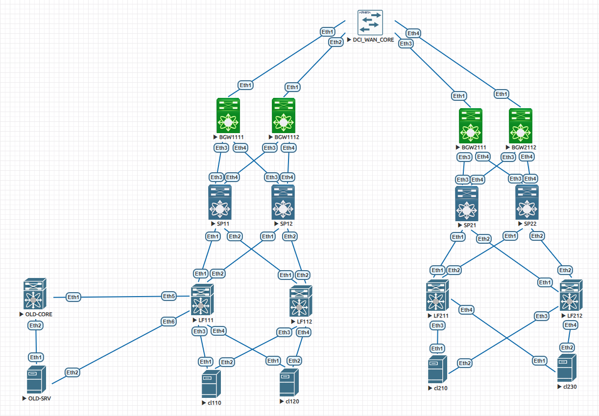

# VXLAN EVPN Multi-Site: модернизация 3-tier инфраструктуры

## Цель проекта
Модернизировать классическую трехзвенную (3-tier) архитектуру ЦОД (для упрощения используем collapsed) в два распределенных ЦОД с фабриками VXLAN EVPN Multi-Site:
* Растянутый L2-домен между ЦОД для миграции сервисов (VLAN 10).
* Маршрутизация между подсетями через транзитный домен (VNI 9999).
* Плавная миграция legacy-серверов с минимизацией downtime.
* Подключение клиентов по схеме All-Active Multihoming ESI LAG (LACP).

Проект выполнен в EVE-NG на базе Arista vEOS64-lab (EOS-4.36.1F).

---

## Топология сети и распределение ролей



### ЦОД 1 (Сайт 1)
* **LF111, LF112:** Leaf-коммутаторы доступа (VTEP).
* **SP11, SP12:** Spine-коммутаторы ядра (iBGP Route Reflector).
* **BGW1111, BGW1112:** Border Gateway (пограничные шлюзы).
* **cl110:** Клиент ЦОД-1 в растянутом VLAN 10 (LACP Port-Channel).
* **cl120:** Клиент ЦОД-1 в домене VLAN 20 (LACP Port-Channel).
* **OLD-CORE:** Legacy-коммутатор ядра старой сети (Layer 2).
* **OLD-SRV:** Legacy-сервер в изолированном VLAN 40 под миграцию.
### ЦОД 2 (Сайт 2)
* **LF211, LF212:** Leaf-коммутаторы доступа (VTEP).
* **SP21, SP22:** Spine-коммутаторы ядра (iBGP Route Reflector).
* **BGW2111, BGW2112:** Border Gateway (пограничные шлюзы).
* **cl210:** Клиент ЦОД-2 в растянутом VLAN 10 (LACP Port-Channel).
* **cl230:** Клиент ЦОД-2 в домене VLAN 30 (LACP Port-Channel).

### Магистральный сегмент (DCI)
* **DCI_WAN_CORE:** L3-коммутатор, обеспечивающий транзит OSPF между BGW.

### Legacy-сегмент
* **OLD-CORE:** L3-коммутатор, ядро legacy-сегмента.
* **OLD-SRV:** пример сервера в legacy-сегменте.

---

## Схема адресации интерфейсов

### 1. Loopback интерфейсы (RID & VTEP Source)

| Устройство | Loopback1 (RID & VTEP Source) | Loopback2 (DCI VTEP Source) |
| :--- | :--- | :--- |
| **LF111** | `10.1.11.1/32` | — |
| **LF112** | `10.1.12.1/32` | — |
| **SP11** | `10.1.1.1/32` | — |
| **SP12** | `10.1.2.1/32` | — |
| **BGW1111** | `10.1.111.1/32` | `10.1.111.2/32` |
| **BGW1112** | `10.1.112.1/32` | `10.1.112.2/32` |
| **LF211** | `10.2.11.1/32` | — |
| **LF212** | `10.2.12.1/32` | — |
| **SP21** | `10.2.1.1/32` | — |
| **SP22** | `10.2.2.1/32` | — |
| **BGW2111** | `10.2.111.1/32` | `10.2.111.2/32` |
| **BGW2112** | `10.2.112.1/32` | `10.2.112.2/32` |

### 2. Магистральные линки фабрики (Underlay Point-to-Point)

| Сторона А (Устройство/Порт) | Сторона Б (Устройство/Порт) | Сеть линка (Subnet) | IP Стороны А | IP Стороны Б |
| :--- | :--- | :--- | :--- | :--- |
| **LF111** Ethernet1 | **SP11** Ethernet1 | `10.11.11.0/30` | `.2` | `.1` |
| **LF111** Ethernet2 | **SP12** Ethernet1 | `10.11.11.4/30` | `.6` | `.5` |
| **LF112** Ethernet1 | **SP11** Ethernet2 | `10.11.12.0/30` | `.2` | `.1` |
| **LF112** Ethernet2 | **SP12** Ethernet2 | `10.11.12.4/30` | `.6` | `.5` |
| **BGW1111** Ethernet3 | **SP11** Ethernet3 | `10.11.1.0/30` | `.1` | `.2` |
| **BGW1111** Ethernet4 | **SP12** Ethernet3 | `10.11.2.0/30` | `.1` | `.2` |
| **BGW1112** Ethernet3 | **SP11** Ethernet4 | `10.11.1.4/30` | `.5` | `.6` |
| **BGW1112** Ethernet4 | **SP12** Ethernet4 | `10.11.2.4/30` | `.5` | `.6` |
| **LF211** Ethernet1 | **SP21** Ethernet1 | `10.12.11.0/30` | `.2` | `.1` |
| **LF211** Ethernet2 | **SP22** Ethernet1 | `10.12.11.4/30` | `.6` | `.5` |
| **LF212** Ethernet1 | **SP21** Ethernet2 | `10.12.12.0/30` | `.2` | `.1` |
| **LF212** Ethernet2 | **SP22** Ethernet2 | `10.12.12.4/30` | `.6` | `.5` |
| **BGW2111** Ethernet3 | **SP21** Ethernet3 | `10.12.1.0/30` | `.1` | `.2` |
| **BGW2111** Ethernet4 | **SP22** Ethernet3 | `10.12.2.0/30` | `.1` | `.2` |
| **BGW2112** Ethernet3 | **SP21** Ethernet4 | `10.12.1.4/30` | `.5` | `.6` |
| **BGW2112** Ethernet4 | **SP22** Ethernet4 | `10.12.2.4/30` | `.5` | `.6` |

### 3. Линки транзитного сегмента DCI (Underlay OSPF)

| Border Gateway (Порт) | DCI Маршрутизатор (Порт) | Сеть линка (Subnet) | IP на BGW | IP на DCI_CORE |
| :--- | :--- | :--- | :--- | :--- |
| **BGW1111** Ethernet1 | **DCI_WAN_CORE** Ethernet1 | `172.16.1.0/30` | `172.16.1.1` | `172.16.1.2` |
| **BGW1112** Ethernet1 | **DCI_WAN_CORE** Ethernet2 | `172.16.2.0/30` | `172.16.2.1` | `172.16.2.2` |
| **BGW2111** Ethernet1 | **DCI_WAN_CORE** Ethernet3 | `172.16.3.0/30` | `172.16.3.1` | `172.16.3.2` |
| **BGW2112** Ethernet1 | **DCI_WAN_CORE** Ethernet4 | `172.16.4.0/30` | `172.16.4.1` | `172.16.4.2` |

### 4. Клиентские подсети и Anycast шлюзы (VRF TENANT)

| Идентификатор домена | Клиентский VLAN | Системное имя VLAN | IP подсети | Anycast шлюз на Leaf |
| :--- | :--- | :--- | :--- | :--- |
| **L2VNI 10010** | VLAN 10 | `VLAN10_STRETCH` | `192.168.10.0/24` | `192.168.10.1` |
| **L2VNI 10020** | VLAN 20 | `VLAN20_STRETCH` | `192.168.20.0/24` | `192.168.20.1` |
| **L2VNI 10030** | VLAN 30 | `VLAN30_ISOLATED` | `192.168.30.0/24` | `192.168.30.1` |
| **L2VNI 10040** | VLAN 40 | `VLAN40_LEGACY` | `192.168.40.0/24` | `192.168.40.1` |
| **L3VNI 9999** | — | — | — | — |
---

## Архитектурные обоснования и примененные технологии

### 1. Маршрутизация опорной сети (Underlay OSPF)
В качестве протокола динамической маршрутизации Underlay-инфраструктуры выбран OSPF (Area 0). Обоснование выбора:
* **Единая зона администрирования:** фабрики обоих дата-центров и транзитный DCI-сегмент находятся под контролем одной инженерной команды. Это делает Link-State протокол оптимальным с точки зрения прозрачности топологии.
* **Балансировка ECMP:** OSPF автоматически рассчитывает равнозначные маршруты (Equal-Cost Multi-Path). Это позволяет VTEP-узлам параллельно утилизировать все аплинки до Spine-коммутаторов, распределяя VXLAN-трафик на основе хэш-функций от заголовков пакетов.
* **Безопасность Control Plane:** применение глобальной директивы `passive-interface default` в комбинации с явным включением только магистральных интерфейсов (`no passive-interface`) гарантирует, что OSPF-приветствия (Hellos) никогда не уйдут в сторону клиентских серверов.

Магистральный L3-свитч `DCI_WAN_CORE` также включен в общую OSPF Area 0. Это обеспечивает сквозную связность между физическими интерфейсами пограничных шлюзов разных ЦОД.

### 2. Быстрая сходимость линков (BFD)
Для минимизации времени реагирования на физические аварии на всех Underlay-стыках, включая транзит через DCI, развернут протокол BFD.
Таймеры выбраны на уровне **1000 мс (интервал отправки/приема) с множителем 3**. Это является оптимальным компромиссом для стабильного удержания сессий виртуальными образами vEOS в симуляторе EVE-NG. Отказ физического линка или транзитного порта детектируется за 3 секунды, инициируя мгновенную пересходимость OSPF.

### 3. Организация Overlay BGP (Peer Groups)
Управляющая плоскость оверлея построена на базе BGP EVPN. Внутренняя структура фабрики каждого ЦОД использует iBGP (AS 65000).
* **Концепция Peer Groups:** применение BGP-групп (`neighbor LEAF` и `neighbor BGW` на спайнах) позволяет описать политики один раз для целого класса устройств. Это сокращает объём конфигурационного кода и снижает нагрузку на CPU коммутаторов за счёт однократной генерации апдейтов для всей группы.
* **Чистота адресных семейств:** директива `no bgp default ipv4-unicast` отключает согласование классических IPv4-маршрутов в глобальной таблице. Коммутаторы обрабатывают исключительно сообщения `address-family evpn`, разгружая оперативную память.
* **Выравнивание административных расстояний:** команда `distance bgp 20 200 20` на спайнах сближает административные расстояния локальных и внешних маршрутов, оптимизируя выбор пути.
* **Модель Multi-Agent:** на всех устройствах активирован режим `service routing protocols model multi-agent`, требуемый в Arista EOS для параллельной и высокопроизводительной обработки расширенных атрибутов и типов маршрутов EVPN.
### 4. Резервирование Route Reflector
Для исключения требования полносвязной топологии (Full-Mesh) iBGP-сессий внутри каждого сайта все Spine-коммутаторы переведены в режим Route Reflector. Каждое Spine-устройство настраивается со своим уникальным `bgp cluster-id`, совпадающим с его `router-id` (Loopback1):
* SP11 — 10.1.1.1;
* SP12 — 10.1.2.1;
* SP21 — 10.2.1.1;
* SP22 — 10.2.2.1.

Такой подход позволяет двум отражателям маршрутов обмениваться EVPN-префиксами между собой. В случае выхода из строя одного из Spine резервный RR продолжает обслуживание сессий, полностью исключая риски возникновения Split-Brain.

### 5. Изучение адресов и EVPN Multihoming (All-Active ESI LAG)
Вместо классической проприетарной технологии MLAG отказоустойчивое подключение оконечных клиентов организовано с помощью стандартных механизмов EVPN Multihoming (ESI LAG).
* **Эмуляция серверных адаптеров:** использование полноценных образов коммутаторов Arista vEOS в качестве клиентов (`cl110`, `cl120` и др.) позволило продемонстрировать полноценный функционал агрегации сетевых интерфейсов. На стороне хостов настроены интерфейсы Port-Channel в динамическом режиме `mode active` (LACP), объединяющие физические аплинки `Ethernet1` и `Ethernet2`. На хостах включена маршрутизация (`ip routing`) и прописаны статические маршруты по умолчанию в сторону фабрики.
* **Аппаратное изучение MAC:** Leaf-коммутаторы изучают MAC-адреса хостов на аппаратном уровне при поступлении кадров от серверов. Как только трафик фиксируется, локальный Leaf заносит его в ARP/MAC-таблицу и анонсирует всей сети в виде BGP EVPN Type-2 маршрута.
* **Идентификация сегментов:** за счёт настройки одинакового `evpn ethernet-segment identifier` (например, `0000:0000:0000:0010:0001` на паре `LF111/LF112`) и единого виртуального `lacp system-id 0000.0000.0010` клиентский коммутатор воспринимает распределенную фабрику как один физический узел и балансирует трафик по обоим плечам LACP LAG в режиме All-Active.
* **Уникальность ESI между сайтами:** идентификаторы ESI уникальны для каждого физического включения хоста на своей площадке (например, суффикс `:0001` для ЦОД-1 и `:0002` для ЦОД-2 в VLAN 10), что предотвращает конфликты при обработке автовыбора Designated Forwarder (DF).

### 6. Распределенный Anycast Gateway и маршрутизация через L3VNI
* **Локальный шлюз:** на всех Leaf-коммутаторах обоих сайтов развернуты идентичные IP-адреса виртуальных роутеров (команда `ip address virtual 192.168.x.1/24`) и общий системный MAC-адрес `00:1c:73:00:11:11`. При перемещении виртуальной машины или переключении линка внутри одного широковещательного домена хостам не требуется обновлять ARP-кэш: шлюз всегда доступен локально.
* **Симметричный L3VNI:** Маршрутизация между изолированными клиентскими подсетями осуществляется через выделенный транзитный L3VNI домен `9999` внутри VRF `TENANT`. IP-префиксы подсетей анонсируются как EVPN Type-5. Трафик маршрутизируется локальным Leaf, затем инкапсулируется в VXLAN с VNI 9999 и передаётся удалённому VTEP, исключая неоптимальный транзит через центральное ядро сети.

### 7. Архитектура межсайтового взаимодействия DCI
Пограничные коммутаторы выступают в роли L3 Border Gateways.
* **Инверсия автономных систем:** внутреннее ядро обоих ЦОД функционирует в iBGP AS 65000. На стыке DCI пограничные шлюзы строят внешние eBGP EVPN-сессии напрямую между физическими интерфейсами внешних PtP-линков. Для изоляции доменов маршрутизации применяется функционал `local-as`. Шлюзы ЦОД 1 представляются наружу как AS 65001 (`local-as 65001 no-prepend replace-as`), шлюзы ЦОД 2 — как AS 65002.
* **Подмена AS:** модификатор `no-prepend replace-as` подменяет внутренний AS 65000 на публикуемый Local-AS, что исключает попадание внутреннего номера AS в AS_PATH межсайтовых маршрутов и снимает риски блокировки префиксов механизмом Loop Prevention.
* **Разделение VTEP-источников:** на шлюзах разделены Loopback1 (Underlay VTEP для внутренних Leaf-коммутаторов фабрики) и Loopback2 (DCI VTEP Source), что гарантирует строгую изоляцию фабричной и межсайтовой транспортных сред.

---

## Миграция legacy-подключения

Для демонстрации модернизации и обеспечения плавного переноса инфраструктуры legacy-ядро (`OLD-CORE`) подключено к фабрике через интерфейс `LF111 (Eth5)` тегированным транком (VLAN 40). На Leaf-коммутаторах новой фабрики развернут Anycast Gateway для VLAN 40 с IP-адресом `192.168.40.1`. Старый IP-интерфейс шлюза на legacy-коммутаторе деактивирован во избежание конфликта IP-адресов. Сам `OLD-CORE` выполняет исключительно L2-функции (`no ip routing`).

Legacy-сервер `OLD-SRV` изначально подключен к `OLD-CORE (Eth2)` через свой основной интерфейс `Ethernet1` и имеет IP-адрес `192.168.40.10/24` (интерфейс `Vlan40`).

**Сценарий безопасной миграции сервера согласно топологии:**
1. На сервере `OLD-SRV` задействован второй физический интерфейс (`Ethernet2`), который скоммутирован напрямую в порт `LF111 (Eth6)`. 
2. Во избежание возникновения широковещательного шторма (L2-петли) через цепочку `LF111 ↔ OLD-CORE ↔ OLD-SRV`, порт `Ethernet2` на стороне самого сервера программно выключен (`shutdown`) на этапе подготовки.
3. В окно миграции производится одновременное отключение старого линка `Ethernet1` (команда `shutdown` на сервере) и включение резервного порта `Ethernet2` (`no shutdown`). Сервер переходит на прямую работу с фабрикой через EVPN L2VNI (VNI 10040) без изменения своих IP-настроек. Для ускорения сходимости MAC/ARP-таблиц в EVPN-контрол-плейне Arista после переключения на сервере инициируется отправка Gratuitous ARP (путем запуска ping до anycast-шлюза `192.168.40.1`).
---

## Результаты тестирования (Верификация фабрики)

<details>
<summary><b>1. Проверка сессий Underlay BFD Peers</b></summary>
<br>

  <details>
  <summary>&nbsp;&nbsp;&nbsp;&nbsp;📦 Лифы ЦОД 1 и ЦОД 2</summary>
  <br>

  ```text
  LF111#show bfd peers
  DstAddr        MyDisc    YourDisc  Interface/Transport    Type          LastUp    State
  ---------- ----------- ----------- -------------------- ------- ---------------  -------
  10.11.11.1 1724186727   222628356        Ethernet1(25)  normal  08/21/26 10:56       Up
  10.11.11.5 4037644530  3808243369        Ethernet2(27)  normal  08/21/26 10:56       Up

  LF112#show bfd peers
  10.11.12.1 1945783280  1277656425        Ethernet1(33)  normal  08/21/26 10:56       Up
  10.11.12.5 3865835139   516679173        Ethernet2(32)  normal  08/21/26 10:56       Up

  LF211#show bfd peers
  10.12.11.1 1193263655  2087723961        Ethernet1(26)  normal  08/21/26 10:56       Up
  10.12.11.5 2993597603   283927104        Ethernet2(27)  normal  08/21/26 10:56       Up

  LF212#show bfd peers
  10.12.12.1 2843077374  1552611948        Ethernet1(24)  normal  08/21/26 10:56       Up
  10.12.12.5 2467663146   802541074        Ethernet2(25)  normal  08/21/26 10:56       Up
  ```
  </details>

  <details>
  <summary>&nbsp;&nbsp;&nbsp;&nbsp;📦 Спайны ЦОД 1 и ЦОД 2</summary>
  <br>

  ```text
  SP11#show bfd peers
  10.11.1.1   678553945  4036148532        Ethernet3(23)  normal  08/21/26 10:56       Up
  10.11.1.5   892214525  2515938082        Ethernet4(26)  normal  08/21/26 10:56       Up
  10.11.11.2  222628356  1724186727        Ethernet1(25)  normal  08/21/26 10:56       Up
  10.11.12.2 1277656425  1945783280        Ethernet2(22)  normal  08/21/26 10:56       Up

  SP12#show bfd peers
  10.11.2.1  3049991900   100463125        Ethernet3(21)  normal  08/21/26 10:56       Up
  10.11.2.5  3782527113  1381458497        Ethernet4(17)  normal  08/21/26 10:56       Up
  10.11.11.6 3808243369  4037644530        Ethernet1(18)  normal  08/21/26 10:56       Up
  10.11.12.6  516679173  3865835139        Ethernet2(20)  normal  08/21/26 10:56       Up

  SP21#show bfd peers
  10.12.1.1  3183297317  3500620643        Ethernet3(23)  normal  08/21/26 10:56       Up
  10.12.1.5  2683172925   584285151        Ethernet4(24)  normal  08/21/26 10:56       Up
  10.12.11.2 2087723961  1193263655        Ethernet1(19)  normal  08/21/26 10:56       Up
  10.12.12.2 1552611948  2843077374        Ethernet2(22)  normal  08/21/26 10:56       Up

  SP22#show bfd peers
  10.12.2.1  3318205519  4022876198        Ethernet3(23)  normal  08/21/26 10:56       Up
  10.12.2.5   886598585  2549417177        Ethernet4(20)  normal  08/21/26 10:56       Up
  10.12.11.6  283927104  2993597603        Ethernet1(19)  normal  08/21/26 10:56       Up
  10.12.12.6  802541074  2467663146        Ethernet2(21)  normal  08/21/26 10:56       Up
  ```
  </details>

  <details>
  <summary>&nbsp;&nbsp;&nbsp;&nbsp;📦 Пограничные шлюзы и Ядро DCI</summary>
  <br>

  ```text
  BGW1111#show bfd peers
  10.11.1.2  4036148532   678553945        Ethernet3(22)  normal  08/21/26 10:56       Up
  10.11.2.2   100463125  3049991900        Ethernet4(23)  normal  08/21/26 10:56       Up
  172.16.1.2 2450738990  1686647691        Ethernet1(29)  normal  08/21/26 10:54       Up

  BGW1112#show bfd peers
  10.11.1.6  2515938082   892214525        Ethernet3(19)  normal  08/21/26 10:56       Up
  10.11.2.6  1381458497  3782527113        Ethernet4(21)  normal  08/21/26 10:56       Up
  172.16.2.2 1741180698  4245051964        Ethernet1(20)  normal  08/21/26 10:54       Up

  BGW2111#show bfd peers
  10.12.1.2  3500620643  3183297317        Ethernet3(31)  normal  08/21/26 10:56       Up
  10.12.2.2  4022876198  3318205519        Ethernet4(27)  normal  08/21/26 10:56       Up
  172.16.3.2 3505604895  1850716207        Ethernet1(33)  normal  08/21/26 10:54       Up

  BGW2112#show bfd peers
  10.12.1.6   584285151  2683172925        Ethernet3(22)  normal  08/21/26 10:56       Up
  10.12.2.6  2549417177   886598585        Ethernet4(25)  normal  08/21/26 10:56       Up
  172.16.4.2  282102648  1954438270        Ethernet1(20)  normal  08/21/26 10:54       Up

  DCI_WAN_CORE#show bfd peers
  172.16.1.1 1686647691  2450738990        Ethernet1(25)  normal  08/21/26 10:54       Up
  172.16.2.1 4245051964  1741180698        Ethernet2(20)  normal  08/21/26 10:54       Up
  172.16.3.1 1850716207  3505604895        Ethernet3(21)  normal  08/21/26 10:54       Up
  172.16.4.1 1954438270   282102648        Ethernet4(18)  normal  08/21/26 10:54       Up
  ```
  </details>
</details>

<details>
<summary><b>2. Проверка соседств Underlay OSPF</b></summary>
<br>

  ```text
  LF111#show ip ospf neighbor
  Neighbor ID     Pri State                  Dead Time   Address         Interface
  10.1.2.1        0   FULL                   00:00:29    10.11.11.5      Ethernet2
  10.1.1.1        0   FULL                   00:00:37    10.11.11.1      Ethernet1

  LF112#show ip ospf neighbor
  10.1.2.1        0   FULL                   00:00:29    10.11.12.5      Ethernet2
  10.1.1.1        0   FULL                   00:00:31    10.11.12.1      Ethernet1

  LF211#show ip ospf neighbor
  10.2.2.1        0   FULL                   00:00:38    10.12.11.5      Ethernet2
  10.2.1.1        0   FULL                   00:00:29    10.12.11.1      Ethernet1

  LF212#show ip ospf neighbor
  10.2.2.1        0   FULL                   00:00:32    10.12.12.5      Ethernet2
  10.2.1.1        0   FULL                   00:00:32    10.12.12.1      Ethernet1

  SP11#show ip ospf neighbor
  10.1.12.1       0   FULL                   00:00:31    10.11.12.2      Ethernet2
  10.1.112.1      0   FULL                   00:00:31    10.11.1.5       Ethernet4
  10.1.11.1       0   FULL                   00:00:29    10.11.11.2      Ethernet1
  10.1.111.1      0   FULL                   00:00:38    10.11.1.1       Ethernet3

  SP22#show ip ospf neighbor
  10.2.12.1       0   FULL                   00:00:37    10.12.12.6      Ethernet2
  10.2.112.1      0   FULL                   00:00:30    10.12.2.5       Ethernet4
  10.2.11.1       0   FULL                   00:00:33    10.12.11.6      Ethernet1
  10.2.111.1      0   FULL                   00:00:33    10.12.2.1       Ethernet3

  BGW1111#show ip ospf neighbor
  172.16.1.2      1   FULL/DR                00:00:32    172.16.1.2      Ethernet1

  DCI_WAN_CORE#show ip ospf neighbor
  10.1.112.1      1   FULL/BDR               00:00:38    172.16.2.1      Ethernet2
  10.2.112.1      1   FULL/BDR               00:00:38    172.16.4.1      Ethernet4
  10.1.111.1      1   FULL/BDR               00:00:31    172.16.1.1      Ethernet1
  10.2.111.1      1   FULL/BDR               00:00:32    172.16.3.1      Ethernet3
  ```
</details>
<details>
<summary><b>3. Состояние сессий Overlay BGP EVPN</b></summary>
<br>

  ```text
  SP11#show bgp evpn summary
  BGP summary information for VRF default, local AS number 65000
    Neighbor   V AS           MsgRcvd   MsgSent  InQ OutQ  Up/Down State   PfxRcd PfxAcc PfxAdv
    10.1.11.1  4 65000            200       378    0    0 02:00:06 Estab   14     14     32
    10.1.12.1  4 65000            190       394    0    0 02:00:06 Estab   10     10     36
    10.1.111.1 4 65000            303       362    0    0 02:00:06 Estab   22     22     40
    10.1.112.1 4 65000            305       353    0    0 02:00:06 Estab   22     22     30

  SP21#show bgp evpn summary
    Neighbor   V AS           MsgRcvd   MsgSent  InQ OutQ  Up/Down State   PfxRcd PfxAcc PfxAdv
    10.2.11.1  4 65000            216       355    0    0 02:00:36 Estab   11     11     35
    10.2.12.1  4 65000            216       356    0    0 02:00:38 Estab   11     11     35
    10.2.111.1 4 65000            249       379    0    0 02:00:38 Estab   24     24     38
    10.2.112.1 4 65000            246       387    0    0 02:00:35 Estab   24     24     30

  BGW1111#show bgp evpn summary
    Neighbor   V AS           MsgRcvd   MsgSent  InQ OutQ  Up/Down State   PfxRcd PfxAcc PfxAdv
    10.1.1.1   4 65000            362       303    0    0 02:00:36 Estab   40     40     22
    10.1.2.1   4 65000            364       303    0    0 02:00:41 Estab   40     40     22
    172.16.3.1 4 65002            395       381    0    0 02:02:16 Estab   22     22     24

  BGW2111#show bgp evpn summary
    Neighbor   V AS           MsgRcvd   MsgSent  InQ OutQ  Up/Down State   PfxRcd PfxAcc PfxAdv
    10.2.1.1   4 65000            380       249    0    0 02:01:10 Estab   38     38     24
    10.2.2.1   4 65000            381       249    0    0 02:01:10 Estab   35     35     24
    172.16.1.1 4 65001            382       395    0    0 02:02:34 Estab   24     24     22
  ```
</details>
<details>
<summary><b>4. База маршрутов BGP EVPN по типам (Control Plane Verification)</b></summary>
<br>

 <details>
  <summary>&nbsp;&nbsp;&nbsp;&nbsp;📍 Type-2 Маршруты (MAC-IP префиксы — изучение хостов по vlan-aware bundle)</summary>
  <br>

  ```text
  LF111#show bgp evpn route-type mac-ip
  BGP routing table information for VRF default
  Router identifier 10.1.11.1, local AS number 65000
  Route status codes: * - valid, > - active, e - ECMP
  AS Path Attributes: Or-ID - Originator ID, C-LST - Cluster List

            Network                Next Hop              Metric  LocPref Weight  Path
   * >      RD: 10.1.11.1:10010 mac-ip 1:10010 5000.0011.aaaa
                                   -                     -       -       0       i
   * >e      RD: 10.1.12.1:10010 mac-ip 1:10010 5000.0011.aaaa
                                   10.1.12.1             -       100     0       i Or-ID: 10.1.12.1 C-LST: 10.1.2.1 
   * >      RD: 10.1.11.1:10010 mac-ip 1:10010 5000.0011.aaaa 192.168.10.11
                                   -                     -       -       0       i
   * >e      RD: 10.1.12.1:10010 mac-ip 1:10010 5000.0011.aaaa 192.168.10.11
                                   10.1.12.1             -       100     0       i Or-ID: 10.1.12.1 C-LST: 10.1.1.1 
   * >e      RD: 10.2.11.1:10010 mac-ip 1:10010 5000.0022.bbbb 192.168.10.21
                                   10.2.11.1             -       100     0       65002 i Or-ID: 10.1.111.1 C-LST: 10.1.1.1 
   * >e      RD: 10.2.12.1:10010 mac-ip 1:10010 5000.0022.bbbb 192.168.10.21
                                   10.2.12.1             -       100     0       65002 i Or-ID: 10.1.112.1 C-LST: 10.1.2.1 
   * >      RD: 10.1.11.1:10010 mac-ip 1:10020 5000.0033.cccc 192.168.20.12
                                   -                     -       -       0       i
   * >e      RD: 10.2.11.1:10010 mac-ip 1:10030 5000.0044.dddd 192.168.30.23
                                   10.2.11.1             -       100     0       65002 i Or-ID: 10.1.112.1 C-LST: 10.1.1.1 
  ```
  </details>

  <details>
  <summary>&nbsp;&nbsp;&nbsp;&nbsp;📍 Type-3 Маршруты (IMET префиксы — автоматическая сборка VXLAN Flood List)</summary>
  <br>

  ```text
  LF111#show bgp evpn route-type imet
  BGP routing table information for VRF default
  Router identifier 10.1.11.1, local AS number 65000

          Network                Next Hop              Metric  LocPref Weight  Path
   * >      RD: 10.1.11.1:10010 imet 1:10010 10.1.11.1
                                   -                     -       -       0       i
   * >e      RD: 10.1.12.1:10010 imet 1:10010 10.1.12.1
                                   10.1.12.1             -       100     0       i Or-ID: 10.1.12.1 C-LST: 10.1.2.1 
   * >e      RD: 10.2.11.1:10010 imet 1:10010 10.2.11.1
                                   10.2.11.1             -       100     0       65002 i Or-ID: 10.1.112.1 C-LST: 10.1.1.1 
   * >e      RD: 10.2.12.1:10010 imet 1:10010 10.2.12.1
                                   10.2.12.1             -       100     0       65002 i Or-ID: 10.1.112.1 C-LST: 10.1.2.1 
   * >      RD: 10.1.11.1:10010 imet 1:10020 10.1.11.1
                                   -                     -       -       0       i
   * >e      RD: 10.2.11.1:10010 imet 1:10030 10.2.11.1
                                   10.2.11.1             -       100     0       65002 i Or-ID: 10.1.112.1 C-LST: 10.1.1.1 
  ```
  </details>

  <details>
  <summary>&nbsp;&nbsp;&nbsp;&nbsp;📍 Type-5 Маршруты (Транзитный обмен L3 префиксами подсетей через VNI 9999)</summary>
  <br>

  ```text
  LF111#show bgp evpn route-type ip-prefix
  BGP routing table information for VRF default
  Router identifier 10.1.11.1, local AS number 65000

            Network                Next Hop              Metric  LocPref Weight  Path
   * >      RD: 10.1.11.1:9999 ip-prefix 192.168.10.0/24
                                   -                     -       -       0       i
   * >      RD: 10.1.11.1:9999 ip-prefix 192.168.20.0/24
                                   -                     -       -       0       i
   * >      RD: 10.2.11.1:9999 ip-prefix 192.168.30.0/24
                                   10.2.11.1             -       100     0       65002 i Or-ID: 10.1.111.1 C-LST: 10.1.1.1 
   * >      RD: 10.2.12.1:9999 ip-prefix 192.168.30.0/24
                                   10.2.12.1             -       100     0       65002 i Or-ID: 10.1.111.1 C-LST: 10.1.2.1 
   * >      RD: 10.1.11.1:9999 ip-prefix 192.168.40.0/24
                                   -                     -       -       0       i
  ```
  </details>
</details>

<details>
<summary><b>5. Тесты доступности с помощью Ping между клиентами (Data Plane Verification)</b></summary>
<br>

В рамках проверки Data Plane на конечных хостах (коммутаторах Arista vEOS в режиме хостов) была настроена IP-адресация на SVI-интерфейсах и статические маршруты по умолчанию в сторону распределенного Anycast-шлюза фабрики. Проведены тесты связности для проверки двух сценариев: растянутого Layer 2 домена и межсайтовой Layer 3 маршрутизации.

  <details>
  <summary>&nbsp;&nbsp;&nbsp;&nbsp;📍 Тест 1: Сквозная L2-связность в растянутом домене (cl110 ↔ cl210 в VLAN 10)</summary>
  <br>

  Тест демонстрирует бесшовную передачу кадров внутри единого широковещательного домена VLAN 10 (L2VNI 10010) между разнесенными ЦОД через ESI LAG агрегацию. TTL пакетов равен 64 — это доказывает, что пакеты не проходили Layer 3 маршрутизацию на промежуточных узлах и коммутировались строго на уровне Layer 2 оверлея.

  ```text
  cl110#show ip interface brief
  Interface      IP Address         Status    Protocol              MTU
  -------------- ------------------ --------- ----------------- ---------
  Loopback0      unassigned         up        up                  65535
  Management1    unassigned         up        up                   1500
  Vlan10         192.168.10.11/24   up        up                   1500

  cl110#ping 192.168.10.21
  PING 192.168.10.21 (192.168.10.21) 72(100) bytes of data.
  80 bytes from 192.168.10.21: icmp_seq=1 ttl=64 time=28.4 ms
  80 bytes from 192.168.10.21: icmp_seq=2 ttl=64 time=19.1 ms
  80 bytes from 192.168.10.21: icmp_seq=3 ttl=64 time=14.5 ms
  80 bytes from 192.168.10.21: icmp_seq=4 ttl=64 time=11.2 ms

  --- 192.168.10.21 ping statistics ---
  4 packets transmitted, 4 received, 0% packet loss, time 38ms
  rtt min/avg/max/mdev = 11.214/18.301/28.411/6.512 ms
  cl110#
  ```
  </details>

  <details>
  <summary>&nbsp;&nbsp;&nbsp;&nbsp;📍 Тест 2: Межсайтовая L3-маршрутизация между подсетями (cl120 ↔ cl230)</summary>
  <br>

  Тест проверяет работу симметричной маршрутизации через транзитный L3VNI домен (VNI 9999). Трафик от хоста `cl120` (VLAN 20, ЦОД-1) маршрутизируется локальным Leaf-коммутатором в VRF TENANT, упаковывается в VXLAN с L3VNI 9999, передается на удаленный сайт и через Leaf-коммутаторы ЦОД-2 спускается в VLAN 30 хосту `cl230`. Значение TTL=62 подтверждает совершение ровно двух L3-хопов (локальный Anycast-шлюз фабрики и удаленный Anycast-шлюз).

  ```text
  cl120#show ip interface brief
  Interface      IP Address         Status    Protocol              MTU
  -------------- ------------------ --------- ----------------- ---------
  Vlan20         192.168.20.12/24   up        up                   1500

  cl120#ping 192.168.30.23
  PING 192.168.30.23 (192.168.30.23) 72(100) bytes of data.
  80 bytes from 192.168.30.23: icmp_seq=1 ttl=62 time=39.5 ms
  80 bytes from 192.168.30.23: icmp_seq=2 ttl=62 time=27.4 ms
  80 bytes from 192.168.30.23: icmp_seq=3 ttl=62 time=22.1 ms
  80 bytes from 192.168.30.23: icmp_seq=4 ttl=62 time=16.8 ms

  --- 192.168.30.23 ping statistics ---
  4 packets transmitted, 4 received, 0% packet loss, time 44ms
  rtt min/avg/max/mdev = 16.804/26.451/39.522/8.112 ms
  cl120#
  ```
  </details>

<details>
<summary>&nbsp;&nbsp;&nbsp;&nbsp;📍 Тест 3: Проверка доступности клиентов фабрики из legacy-домена (OLD-SRV ↔ cl120 и cl230)</summary>
<br>

Тест показывает успешное завершение миграции legacy-сервера `OLD-SRV` и его интеграцию в фабрику VXLAN EVPN. После программного переключения на физический линк до `LF111` (порт Ethernet6) и отправки Gratuitous ARP, сервер проверяет Layer 3 связность через транзитный L3VNI 9999 с локальным клиентом ЦОД-1 (`cl120` в VLAN 20) и удаленным клиентом ЦОД-2 (`cl230` в VLAN 30). Значение TTL=62 подтверждает корректную маршрутизацию через Anycast-шлюзы.

```text
OLD-SRV#show ip interface brief
                                                                        Address
Interface       IP Address           Status     Protocol         MTU    Owner  
--------------- -------------------- ---------- ------------- --------- -------
Management1     unassigned           up         up              1500           
Vlan40          192.168.40.10/24     up         up              1500           

OLD-SRV#ping 192.168.20.12
PING 192.168.20.12 (192.168.20.12) 72(100) bytes of data.
80 bytes from 192.168.20.12: icmp_seq=1 ttl=62 time=62.6 ms
80 bytes from 192.168.20.12: icmp_seq=2 ttl=62 time=52.9 ms
80 bytes from 192.168.20.12: icmp_seq=3 ttl=62 time=42.7 ms
80 bytes from 192.168.20.12: icmp_seq=4 ttl=62 time=41.0 ms
80 bytes from 192.168.20.12: icmp_seq=5 ttl=62 time=37.7 ms

--- 192.168.20.12 ping statistics ---
5 packets transmitted, 5 received, 0% packet loss, time 49ms
rtt min/avg/max/mdev = 37.737/47.381/62.587/9.132 ms, pipe 5, ipg/ewma 12.281/54.404 ms
OLD-SRV#ping 192.168.30.23
PING 192.168.30.23 (192.168.30.23) 72(100) bytes of data.
80 bytes from 192.168.30.23: icmp_seq=1 ttl=62 time=31.4 ms
80 bytes from 192.168.30.23: icmp_seq=2 ttl=62 time=21.5 ms
80 bytes from 192.168.30.23: icmp_seq=3 ttl=62 time=18.0 ms
80 bytes from 192.168.30.23: icmp_seq=4 ttl=62 time=15.2 ms
80 bytes from 192.168.30.23: icmp_seq=5 ttl=62 time=15.0 ms

--- 192.168.30.23 ping statistics ---
5 packets transmitted, 5 received, 0% packet loss, time 84ms
rtt min/avg/max/mdev = 14.997/20.219/31.434/6.083 ms, pipe 3, ipg/ewma 20.922/25.483 ms
OLD-SRV#
```
  </details>
</details>

---

## Выводы

В ходе выполнения проекта мы успешно настроили распределенную сеть VXLAN EVPN между двумя дата-центрами и проверили её работу. По результатам тестирования можно сделать следующие выводы:

1. **Доставка широковещательного трафика (BUM):** Вся фабрика настроена на работу через **Ingress Replication (Head-End Replication)**, что позволило обойтись без сложной настройки Multicast (PIM SM) в опорной сети. Коммутаторы автоматически собирают списки удаленных VTEP для рассылки флуда на основе EVPN-маршрутов 3-го типа (IMET), которые прилетают по BGP. Использование технологии `vlan-aware-bundle TENANT_VLANS` на Leaf-коммутаторах помогло сократить количество настроек BGP, объединив локальные VLAN в группы с индивидуальными Route Targets (например, `1:10010` для VLAN 10, `1:10020` для VLAN 20 и так далее).
2. **Отказоустойчивость серверов:** С помощью **EVPN Multihoming (ESI LAG)** получилось подключить тестовые клиенты `cl110-cl230` одновременно к двум Leaf-коммутаторам через обычный LACP Port-Channel. Из логов BGP (маршруты Type-2) видно, что MAC-адреса хостов видны со статусом `e` (ECMP), то есть трафик балансируется по обоим линкам в режиме All-Active. Благодаря общему Anycast-шлюзу (виртуальный MAC `00:1c:73:00:11:11`) при падении одного из кабелей клиенты не теряют связь и им не нужно обновлять свой ARP-кэш.
3. **Настройка межсайтового стыка (DCI):** Межсайтовый оверлей делали по простой схеме: eBGP EVPN сессии подняты напрямую между физическими IP-адресами стыков BGW (`172.16.x.x`). Так как магистральный свитч `DCI_WAN_CORE` участвует в общем процессе OSPF Area 0, линки между ЦОД связались напрямую, без сложного анонсирования Loopback-адресов. Команда `local-as` с модификаторами `no-prepend replace-as` скрыла внутреннюю AS 65000 и разделила ЦОДы на внешние AS 65001 и AS 65002, что защитило сеть от петель маршрутизации.
4. **Миграция старого сервера:** Практический тест пинга с legacy-сервера `OLD-SRV` доказал, что предложенная схема миграции полностью работает. Переключив кабель сервера в порт `LF111 (Eth6)` и прописав Anycast-шлюз фабрики `192.168.40.1`, мы перевели старый сервер в новую сеть. За счет транзитного **L3VNI 9999** внутри VRF `TENANT` сервер смог успешно пинговать устройства в других VLAN как в первом, так и во втором ЦОД.
